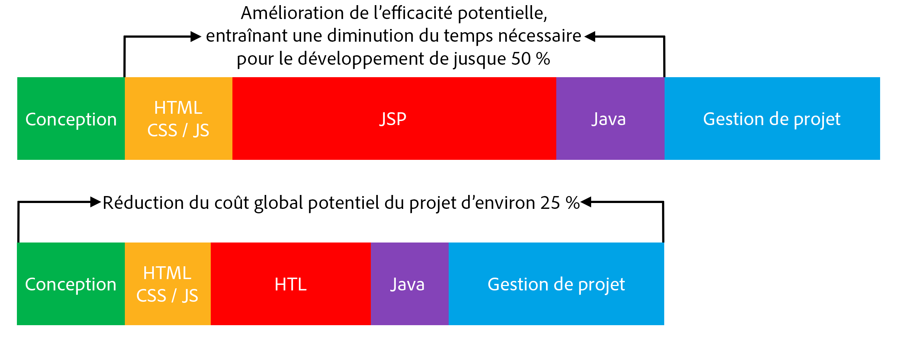

# Présentation {#overview}

L’objectif du langage HTL (HTML Template Language), pris en charge par Adobe Experience Manager (AEM), est d’offrir une structure web extrêmement productive au niveau de l’entreprise qui renforce la sécurité et permet aux développeurs HTML sans connaissance de Java de participer de manière plus efficace aux projets AEM.

Le langage de modèle HTML est le système de modèle côté serveur recommandé et préféré pour le format HTML en AEM. HTL a été introduit avec AEM 6.0 et remplace JSP (JavaServer Pages). Pour les développeurs web qui souhaitent créer des sites web d’entreprise performants, le langage HTL contribue à améliorer l’efficacité au niveau de la sécurité et du développement.

## Sécurité renforcée {#increased-security}

Le langage HTL accroît la sécurité des sites qui l’utilisent dans leur mise en œuvre, par rapport à JSP et la plupart des autres systèmes de modèle, car HTL est capable d’appliquer automatiquement l’échappement approprié adapté au contexte à toutes les variables qui s’affichent sur la couche de présentation. HTL rend cela possible, car il comprend la syntaxe HTML et l’utilise pour ajuster l’échappement nécessaire aux expressions, en fonction de leur position dans les balises. Cela aura pour conséquence, par exemple, que des expressions placées dans les attributs `href` ou `src` seront placées dans une séquence d’échappement différemment des expressions placées dans d’autres attributs ou ailleurs.

Si le même résultat peut être obtenu avec des langages de modèle en JSP, le développeur doit s’assurer manuellement que l’échappement adéquat est appliqué à chaque variable. Comme une simple omission ou erreur sur un échappement appliqué suffit potentiellement à entraîner une vulnérabilité de type attaque multisite par scripts (XSS), nous avons décidé d’automatiser cette tâche avec HTL. Si nécessaire, les développeurs peuvent tout de même indiquer un échappement différent sur les expressions, mais avec HTL, le comportement par défaut est bien plus susceptible de corresponde au comportement souhaité, ce qui réduit la probabilité d’erreurs.

## Développement simplifié   {#simplified-development}

Il est facile d’apprendre le langage de modèle HTML. Ses fonctionnalités sont volontairement limitées pour assurer un apprentissage simple et direct. Il comporte également des mécanismes performants pour structurer les balises et appeler la logique, tout en appliquant toujours une séparation stricte des problèmes entre l’annotation et la logique. HTL lui-même est aux standards du HTML5, car il utilise des expressions et des attributs de données pour annoter les balises avec le comportement dynamique souhaité, ce qui signifie qu’il n’interrompt pas la disponibilité des balises, qui restent lisibles. Notez que l’évaluation des expressions et des attributs de données est effectuée entièrement du côté serveur et ne sera pas visible du côté client, où toute autre structure JavaScript souhaitée peut être utilisée sans interférence.

Ces fonctionnalités permettent aux développeurs HTML sans connaissance préalable de Java et avec peu de connaissances spécifiques du produit de modifier les modèles HTL. Ils peuvent ainsi faire partie de l’équipe de développement et cela simplifie la collaboration avec les développeurs Java de plein-pile. Réciproquement, cela permet aux développeurs Java de se concentrer sur le code principal sans se soucier du HTML.

## Réduction des coûts   {#reduced-costs}

Une sécurité renforcée, un développement simplifié et une meilleure collaboration des équipes se traduisent dans les projets AEM par des efforts réduits, une mise sur le marché plus rapide et un moindre coût total de propriété du parc.

Concrètement, d’après nos observations lors de la nouvelle mise en œuvre du site Adobe.com avec le langage HTL, le coût et la durée du projet peuvent être réduits d’environ 25 %.

Le diagramme ci-dessus montre que HTL permet potentiellement d’améliorer l’efficacité des domaines suivants :

* **HTML/CSS/JS :** Comme les développeurs HTML peuvent modifier directement les modèles HTL, les conceptions frontales n’ont plus besoin d’être mises en œuvre séparément du projet AEM, mais peuvent être mises en œuvre directement sur les composants proprement dits d’AEM. Cela permet de réduire les itérations laborieuses pour les développeurs Java de plein-pile.
* **JSP/HTL :** Comme HTL ne nécessite en soi aucune connaissance de Java et est simple à écrire, tout développeur maîtrisant l’HTML peut modifier les modèles.
* **Java :** Grâce à l’API Use claire et simple d’utilisation proposée par HTL, l’interface de logique métier est clarifiée, ce qui profite également au développement Java dans son ensemble.

**À lire aussi :**

* [Prise en main du langage HTL](getting-started.md)
